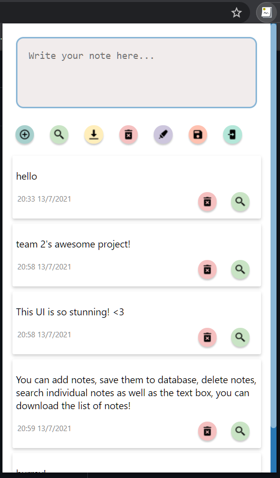
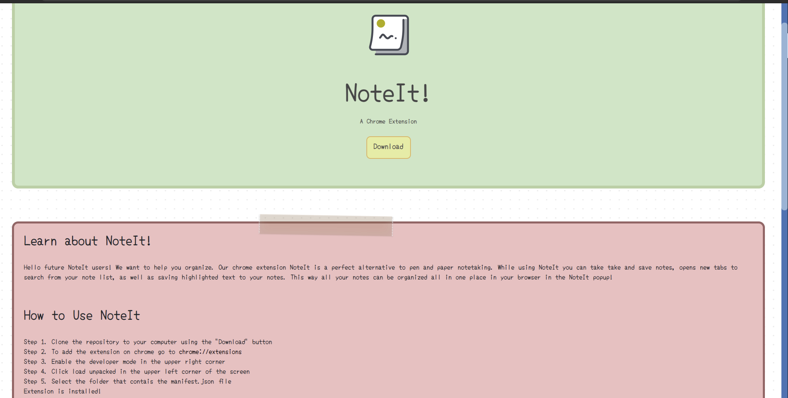
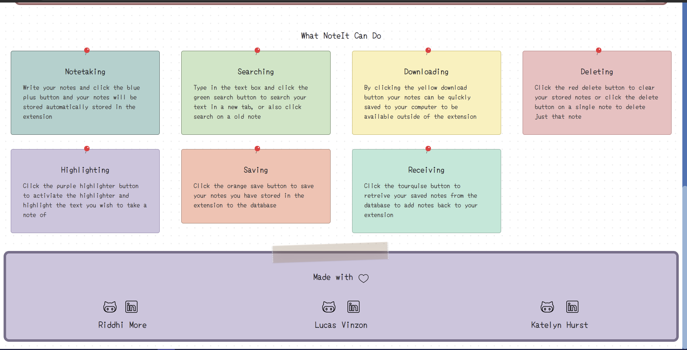

# Chrome Extension NoteIt! :memo:

## :star: Project Description :star:
Hello developers! Let's help you organize, presenting to you, :sparkles:NoteIt!:sparkles: A chrome extension used to take and save notes, open new tabs to search from list directly, as well as saving highlighted texts and so much more!
See sample shot at the bottom of README to view how the working project appears in your chrome browser.

## :information_source: How to Test the Extension
- Save the files to your local machine:arrow_down:
- To add extension as developer you first go to `chrome://extensions`
- Enable the develper mode from the upper right corner
- Click `load unpacked` in the upper left corner:arrow_upper_left:
- Select the folder:open_file_folder: that contains the `manifest.json` file
- Extension is installed!

## Features Implemented
- **Add:** When you want to take a note, you simply type your note into the text box that says, “Write your note here…”, then you can press the Add Note button to store your note in your list of notes in the extension. The extension will save your notes for as long as you like.
- **Web Search:mag_right::** There are two different ways to use the Search Web feature. First, you may type into the “Write your note here…” text box and click the Search Web button in the options menu. This will open a new tab in your browser Google searching your test. You can also search a previous note that is NoteIt has saved in the pop out for you by clicking the Search Web button on that note! Awesome right?
- **Download List:** Download your list of notes in the extension to your computer as file for offline excess
- **Delete List:x::** When you no longer need your saved notes, you can clear your list of notes by clicking the Delete All button in the options menu. If you would like to just delete a single note from the list, you can select the Delete Note button one that singular note.
- **Edit List:pencil2::** Edit a saved list item just by clicking on it
- **Highlighter:** To save time from typing if you would like a shortcut, you can turn on the highlight feature and then select the text you want from the webpage, and this will add your selected text to your list of notes in the extension!
- **Individual Features:** Delete and search for individual notes!
- **Database:** Notes can be saved and retreived from a database instead of saving notes as a file to your computer
-  **Saving Notes:** Click save notes to store your list of notes to the database until you need them again. Note – you can only store one list of notes to the database at a time when you retrieve your saved notes the database will be cleared to make room for a new list you would like to save in the future!
- **Retreiving:** Click the retreive button the retreive your last saved notes from the database. Note! When you retreive old notes from the database anything that is currently in your notes list in the extension will be replaced by the retreived notes, so make sure you download any notes you want to keep to your computer!

## :star: Chrome UI :star:

## NoteIt Infomational Website 🖥️
NoteIt has an accompanying website where you can find all you need to know. The NoteIt website shows you about how to use the extension, where to download it, the features offered, as well as infomation and links to the creators social accounts.
You can check out the website at
#### https://mlh-noteit.netlify.app/
See the code at 
#### https://github.com/MsMore/Note-It-website

## Techonologies Used
NoteIt is built using JavaScript with HTML and CSS.

## Authors :family:
#### Riddhi More
- https://github.com/MsMore
#### Lucas Vinzon
- https://github.com/SnowPrimate
#### Katelyn Hurst
- https://github.com/hurstkatelyn

