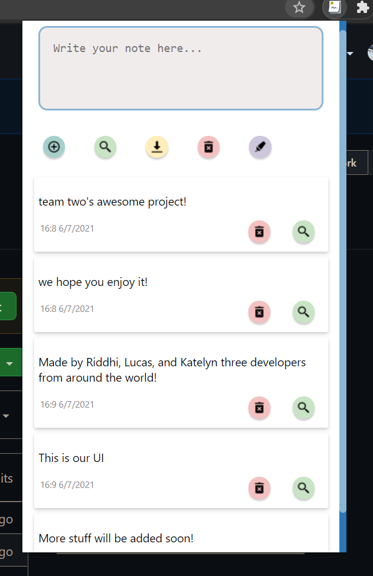

# Chrome Extension NoteIt! 

## Project Description
Hello developers! Let's help you organise, presenting to you this (we will name it later), chrome extension used to take and save notes, open new tabs to search from list directly, as well as saving highlighted texts and so much more!
See sample shot at the bottom of README to view how the working project appears in the chrome browser.

## Techonologies Used
The chrome extension is built using JavaScript with HTML and CSS.

## How to Test the Extension
- Save the files to your local machine
- To add extension as developer you first go to `chrome://extensions`
- Enable the develper mode from the upper right corner
- Click `load unpacked` in the upper left corner
- Select the folder that contains the `manifest.json` file
- Extension is installed!

## Features Implemented
- **Add:** write note and add to list
- **Web Search:** search the text directly from your text box
- **Download List:** get you list into your local device
- **Delete List:** delets all saved lists
- **Edit List:** edit a saved list item just by clicking on it
- **Highlighter:** highlght text to directly add it to your list, no more typing!
- **Individual Features:** delete and search for individual notes!

##Coming Soon!
- Database Integration
- Documentaton Website
- **Highlighter Bug Fixes:** Highlight acts funny sometimes!
- **Markup:** colors for highligher text

## Chrome UI

## Authors
- Riddhi More
- Lucas Vinzon
- Katelyn Hurst

